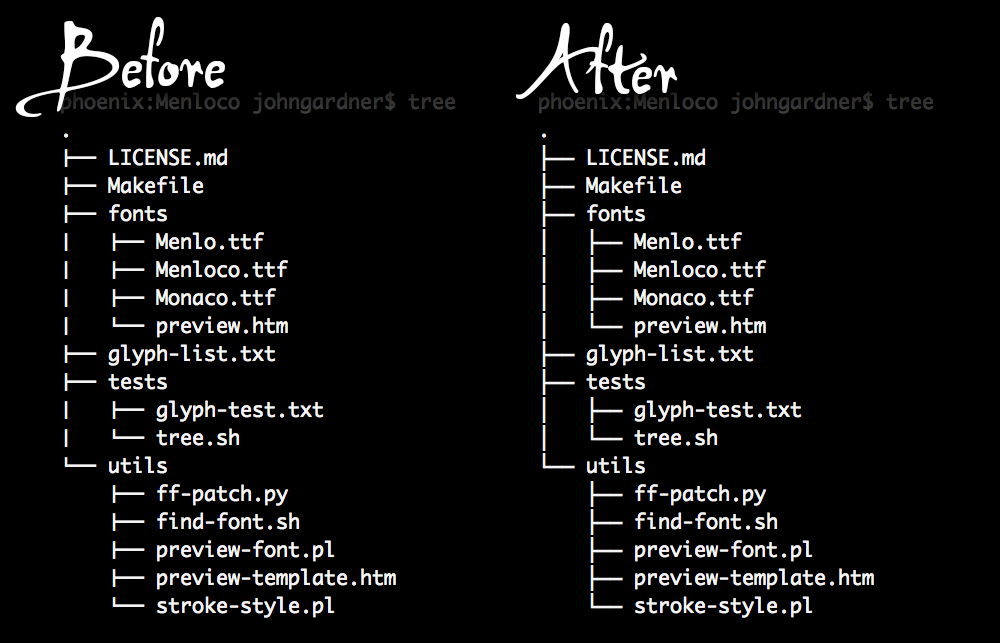

Menloco
=======

Adds seamless box-drawing characters to the Monaco typeface:

Instructions
------------
Clone this repo, `cd` into it, and run `make`:

    git clone git@github.com:Alhadis/Menloco.git
    cd Menloco
    make

You'll find a copy of the patched typeface sitting in the `fonts` subdirectory,
named `Menloco.ttf`. Install this at your leisure; running these scripts won't
modify any existing typefaces on your system, for self-explanatory reasons.

Requirements
------------
These scripts rely on [FontForge](https://fontforge.github.io/) to do the heavy
lifting, so you'll need to make sure that's installed first. You can install it
using [Homebrew](http://brew.sh/):

    brew install fontforge

Other systems
-------------
This project was written with Mac OS in mind (I'm running Mavericks). If you're
interested in running it on another operating system, you'll need the following
in addition to FontForge:

1. Perl v5.10+
2. Python v2.7+
3. [GNU Make](https://www.gnu.org/software/make/manual/make.html)

For Windows/Cygwin, I have no idea. Have a crack at it and report any troubles.

Why?
----
I love the clean elegance of Monaco, but wanted nicer-looking graphs and tables
when perusing terminal output. Programs like `npm` and `tree`, for example, use
box-drawing symbols to annotate the relationships between their contents; these
look weird when they're punctuated with gaps.

Wanting the best of both worlds, I penned these scripts to bring them together.
Obviously I could simply upload the modified typeface, but that'd be infringing
copyright. Since both fonts are already installed on Mac OS by default, it's an
easy matter of running the bundled scripts with `make`.
